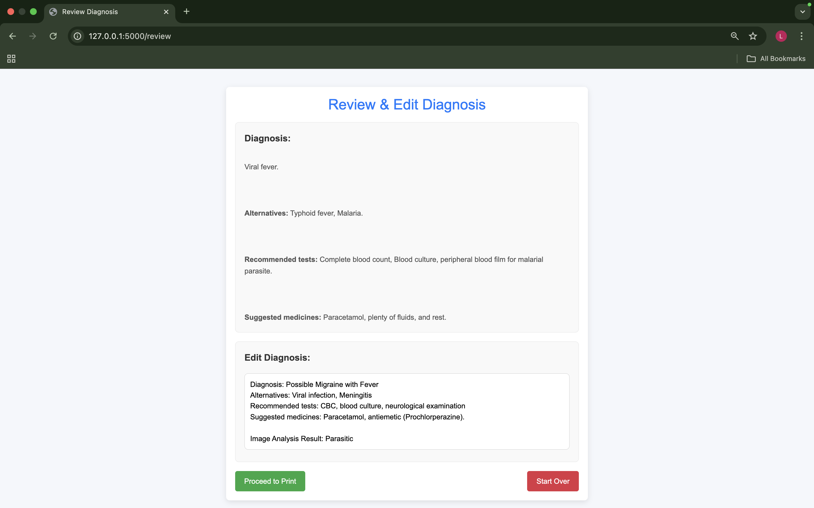
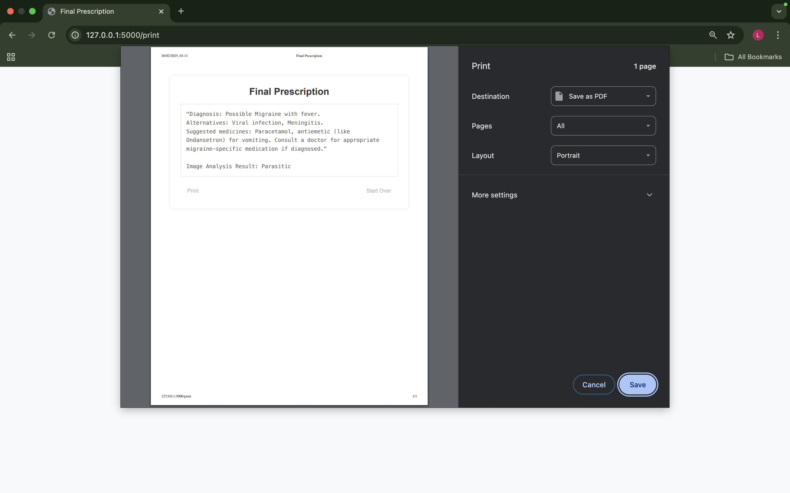

### **Diagnostic Assistant**  
*A machine-learning-powered web application for diagnosing medical conditions based on image inputs.*  

## **Overview**  
The **Diagnostic Assistant** is a Flask-based web application that utilizes a deep learning model to analyze medical images and provide diagnostic insights. The system allows users to upload medical images, process them through a trained model, and receive an evaluation. The results are displayed on an interactive UI with additional options for reviewing and printing the diagnosis.  

## **Features**  
- **Image Upload**: Users can upload medical images for diagnosis.  
- **Deep Learning Model**: The application employs a pre-trained Keras model for image classification.  
- **Flask Web Server**: Manages image processing, model inference, and result rendering.  
- **Interactive UI**: Built with HTML, CSS, and JavaScript to provide a smooth user experience.  
- **Review and Print**: Users can review the diagnosis and print the results for documentation.  

## **Project Structure**  
```
Diagnostic_Assistant/
│── backend/  
│   │── app.py (Main Flask application)  
│   │── app1.py (Additional backend functionalities)  
│   │── requirements.txt (Dependencies for the project)  
│── static/  
│   │── script.js (Frontend logic)  
│   │── styles.css (Styling for UI)  
│── templates/  
│   │── index.html (Main UI)  
│   │── review.html (Review page)  
│   │── print.html (Print diagnosis)  
│── uploads/ (Uploaded images)  
│── venv/ (Virtual environment)  
│── malaria_detect_model.keras (Pre-trained ML model)  
```

## **Installation & Setup**  
### **1. Clone the Repository**  
```bash
git clone https://github.com/lakshug23/diagnostic_assistant.git
cd Diagnostic_Assistant
```

### **2. Set Up Virtual Environment**  
```bash
python3 -m venv venv
source venv/bin/activate   # On Windows use: venv\Scripts\activate
```

### **3. Install Dependencies**  
```bash
pip install -r requirements.txt
```

### **4. Run the Application**  
```bash
python app.py
```
The Flask server will start at `http://127.0.0.1:5000/`. Open this URL in your browser to access the Diagnostic Assistant.

## **Usage**  
1. Open the web app in your browser.  
2. Upload a medical image (e.g., malaria-infected blood sample).  
3. Click on **Diagnose** to analyze the image.  
4. View the results and proceed to **Review** or **Print** the diagnosis.  

## **Tech Stack**  
- **Backend**: Python, Flask  
- **Frontend**: HTML, CSS, JavaScript  
- **Machine Learning**: Keras, TensorFlow  
- **Deployment**: Local server via Flask  

## **Future Improvements**  
- Implement a more advanced ML model for better accuracy.  
- Add user authentication and history tracking.  
- Enable cloud-based model inference for faster processing.  

## **Screenshots**  
### **1. Home Page**  
  

### **2. Diagnosis Page**  
  

### **3. Prescription Page**  
  

### **4. Print Page**  
  
